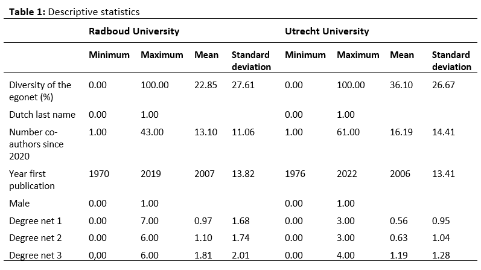

```{r, install remotely, globalsettings, echo=FALSE, warning=FALSE, results='hide', eval=FALSE}
install.packages("remotes")
remotes::install_github("rlesur/klippy")
``` 

```{r, globalsettings, echo=FALSE, warning=FALSE, results='hide'}
library(knitr)
library(rgl)

knitr::opts_chunk$set(echo = TRUE)
opts_chunk$set(tidy.opts=list(width.cutoff=100),tidy=TRUE, warning = FALSE, message = FALSE,comment = "#>", cache=TRUE, class.source=c("test"), class.output=c("test2"))
options(width = 100)
rgl::setupKnitr()


colorize <- function(x, color) {sprintf("<span style='color: %s;'>%s</span>", color, x) }

```

```{r klippy, echo=FALSE, include=TRUE}
klippy::klippy(position = c('top', 'right'))
#klippy::klippy(color = 'darkred')
#klippy::klippy(tooltip_message = 'Click to copy', tooltip_success = 'Done')
```

```{r, echo=FALSE}
#start with clean workspace 
rm(list=ls())
getwd()
```
&nbsp;

# Descriptives Radboud University

```{r}
load("./data/descriptives/RU_net_array_sym.RData")
load("./data/descriptives/RU_dfv2.RData")
```

```{r}
# construct dyadcharacteristic whether nodes are similar/homogenous
fhomomat <- function(x) {
    # x is a vector of node-covariate
    xmat <- matrix(x, nrow = length(x), ncol = length(x))
    xmatt <- t(xmat)
    xhomo <- xmat == xmatt
    return(xhomo)
}

# a function to calculate all valid dyads.
fndyads <- function(x) {
    diag(x) <- NA
    x[x == 10] <- NA
    (sum((x == 1 | x == 0), na.rm = T))
}

# a function to calculate all valid intragroupdyads.
fndyads2 <- function(x, A) {
    diag(x) <- NA
    x[x == 10] <- NA
    diag(A) <- NA
    (sum((x == 1 | x == 0) & A == 1, na.rm = T))
}

# density: observed relations divided by possible relations
fdensity <- function(x) {
    # x is your nomination network make sure diagonal cells are NA
    diag(x) <- NA
    # take care of RSiena structural zeros, set as missing.
    x[x == 10] <- NA
    sum(x == 1, na.rm = T)/(sum(x == 1 | x == 0, na.rm = T))
}

# calculate intragroup density
fdensityintra <- function(x, A) {
    # A is matrix indicating whether nodes in dyad have same node attributes
    diag(x) <- NA
    x[x == 10] <- NA
    diag(A) <- NA
    sum(x == 1 & A == 1, na.rm = T)/(sum((x == 1 | x == 0) & A == 1, na.rm = T))
}

# calculate intergroup density
fdensityinter <- function(x, A) {
    # A is matrix indicating whether nodes in dyad have same node attributes
    diag(x) <- NA
    x[x == 10] <- NA
    diag(A) <- NA
    sum(x == 1 & A != 1, na.rm = T)/(sum((x == 1 | x == 0) & A != 1, na.rm = T))
}
```

## Descriptives of the variables

&nbsp;

### Ethnicity egos
```{r}
summary(soc_df$div.ego)
table(soc_df$div.ego)

# histogram ethnicity egos
library(ggplot2)
#install.packages("plotly")
library(plotly)

colnames(soc_df) <- make.unique(names(soc_df))

baretniru <- ggplot2:::ggplot(soc_df, aes(factor(div.ego), fill = factor(div.ego))) + geom_bar()
baretniru <- baretniru + scale_fill_manual(values=c("#56B4E9", "#66ff99"))
ggplotly(baretniru + ggtitle("RU: gender sociology staff"))
```
Within the department of Sociology at the Radboud University, 12.90 percent of the ego's has a non-Dutch last name and 87.10 percent has a Dutch last name (table 2).

### Gender egos
```{r}
table(soc_df$gender)
# Visualisation of the ethnicitycomposition of the three waves

# histogram of the gendercomposition

bargenderru <- ggplot2:::ggplot(soc_df, aes(factor(gender), fill = factor(gender))) + geom_bar()
bargenderru <- bargenderru + scale_fill_manual(values=c("#56B4E9", "#66ff99"))
ggplotly(bargenderru + ggtitle("RU: Gender sociology staff")) 


```
The gender of sociologists working at the Radboud University is much more equal. 48.39 percent is female and 51.61 percent is male (table 3).

### Percentage non-Dutch collaborators

```{r}
summary(soc_df$div.net)
sd(soc_df$div.net, na.rm=TRUE)

hist(soc_df$div.net, col="lightseagreen", main='RU: ethnic diversity egonets')
```

&nbsp;

On average, sociology staff members from Radboud University had 22.85 percent of non-Dutch collaborators in their egonet (table 1). Furthermore, the histogram is right-skewed: most scholars had a percentage between the 0 and 20.

### Year first publication

```{r}
summary(soc_df$pub_first)
sd(soc_df$pub_first, na.rm=TRUE)
hist(soc_df$pub_first, col="lightseagreen", main='RU: first publication ego', xlab='year of first publication')
```

&nbsp;

On average, sociologists from Radboud University published their first paper in 2007 (table 1). The oldest first publication of an ego within the department is from 1970, the newest first publication is from 2019. The histogram is skewed to the left: most scholars from within the department are relatively new and have published their first paper somewhere during the last decade.

&nbsp;

## Network descriptives
### Plots of the network
The size of the vertexes is based on the percentage of non-Dutch last names in the ego's network. The higher the vertex, the higher the percentage of non-Dutch co-authors.
The colour of the vertex label is based on the ethnicity of the egos themselves. Black means a Dutch last name, red a non-Dutch last name.

```{r}
# PERIOD 2016-2017
runet1 <- net_soc_array[ ,, 1]
diag(runet1) <- 0

#changing colour based on diversity of network.

soc_df$gcol <- ifelse(soc_df$div.ego == "1", "black", "magenta4")

runet1_g <- igraph::graph_from_adjacency_matrix(runet1, mode = c("undirected"))
plot(runet1_g, vertex.label = soc_df$lastname, vertex.label.color = soc_df$gcol, vertex.size = soc_df$div.net*0.2, vertex.color = "mediumturquoise", vertex.label.size = 0.5, vertex.label.cex = 0.6, edge.curved = 0.2, edge.arrow.size = 1.7)

# PERIOD 2018-2019
runet2 <- net_soc_array[ ,, 2]
diag(runet2) <- 0

runet2_g <- igraph::graph_from_adjacency_matrix(runet2, mode = c("undirected"))
plot(runet2_g, vertex.label = soc_df$lastname, vertex.label.color = soc_df$gcol, vertex.size = soc_df$div.net*0.2, vertex.color = "mediumturquoise", vertex.label.size = 0.5, vertex.label.cex = 0.6, edge.curved = 0.2, edge.arrow.size = 1.7)

# PERIOD 2020-2022
runet3 <- net_soc_array[ ,, 3]
diag(runet3) <- 0

runet3_g <- igraph::graph_from_adjacency_matrix(runet3, mode = c("undirected"))
plot(runet3_g, vertex.label = soc_df$lastname, vertex.label.color = soc_df$gcol, vertex.size = soc_df$div.net*0.2, vertex.color = "mediumturquoise", vertex.label.size = 0.5, vertex.label.cex = 0.6, edge.curved = 0.2, edge.arrow.size = 1.7)

```

&nbsp;

From the plots of the sociology department of the Radboud University, we can see that the number of people co-publishing within the department increases over the year. This can be explained by the fact that younger sociologists did not yet work at the university in the earlier periods, so they could also not have worked together. Kraaykamp has the highest number of co-authors: this is a scholar who has been active in the department for a longer time, explaining the higher number of co-authors.
&nbsp;
 
### Degrees

```{r}
# Degrees
degree <- rowSums(runet1)
summary(degree)
sd(degree)
hist(degree, col="lightseagreen", main='RU: degree distribution wave 1', xlab='number of ties')
```

&nbsp;


```{r}
degree <- rowSums(runet2)
summary(degree)
sd(degree)
hist(degree, col="lightseagreen", main='RU: degree distribution wave 2', xlab='number of ties')

```


```{r}
# Degrees
degree <- rowSums(runet3)
summary(degree)
sd(degree)
hist(degree, col="lightseagreen", main='RU: degree distribution wave 3', xlab='number of ties')

```

&nbsp;

The number of ties within the department of the Radboud University increases over waves, as was also visible in the plots. The average number of ties increased from 0.97 ties in 2016-2017, to 1.097 ties in 2018-2019 and 1.806 ties in 2020-2022. 
&nbsp;
Furthermore, we see that the histograms of degrees are right-skewed: most scholars do not have many ties within the department. However, the distribution becomes less skewed over the waves. 

### Densities
```{r}
runet_und1 <- runet1 + t(runet1)
runet_und1[runet_und1==2] <- 1
sum(runet_und1, na.rm=TRUE)
fdensity(runet1)
runet_und1 <- runet1 + t(runet1)
runet_und1[runet_und1==2] <- 1

runet_und2 <- runet2 + t(runet2)
runet_und2[runet_und2==2] <- 1
sum(runet_und2, na.rm=TRUE)
fdensity(runet2)
runet_und2 <- runet2 + t(runet2)
runet_und2[runet_und2==2] <- 1

runet_und3 <- runet3 + t(runet3)
runet_und3[runet_und3==2] <- 1
sum(runet_und3, na.rm=TRUE)
fdensity(runet3)
runet_und3 <- runet3 + t(runet3)
runet_und3[runet_und3==2] <- 1
```
Density contains all observed relations divided by all possible relations.
&nbsp;
The network of wave 1 contains 30 dyads. The number of dyads is relatively low to the number of dyads which are possible, as the edge density contains 0.032. Wave 2 consists of a little bit more dyads: 34. However, the edge density of 0.037 is still relatively low. We see a strong increase in density in wave 3: there are 56 dyads and the edge density contains 0.060.

&nbsp;

### Inter-/intragroup density ethnicity

&nbsp;

**Intergroup**

```{r}
div_m <-  fhomomat(soc_df$div.ego)

fdensityinter(x=runet_und1, A=div_m)
fdensityinter(x=runet_und2, A=div_m)
fdensityinter(x=runet_und3, A=div_m)
```

&nbsp;

**Intragroup**

```{r}
fdensityintra(x=runet_und1, A=div_m) 
fdensityintra(x=runet_und2, A=div_m) 
fdensityintra(x=runet_und3, A=div_m)
```

&nbsp;

The intergroup density shows the density between the two different ethnic groups (Dutch or non-Dutch). The intragroup density contains the density of scholars from the same ethnic group (Dutch or non-Dutch). Both the intergroup and intragroup densities increase over the waves. Generally, the intergroup densities are lower than the intragroup densities. This means that sociologists from the Radboud University are more likely to collaborate with people from the same ethnic background (Dutch or non-Dutch) and ethnic segregation might be visible.

&nbsp;

### Inter-/intragroup density gender

&nbsp;

**Intergroup**

```{r}
gender_m <-  fhomomat(soc_df$gender)

fdensityinter(x=runet_und1, A=gender_m)
fdensityinter(x=runet_und2, A=gender_m)
fdensityinter(x=runet_und3, A=gender_m)
```

&nbsp;

**Intragroup**

```{r}
fdensityintra(x=runet_und1, A=gender_m) 
fdensityintra(x=runet_und2, A=gender_m) 
fdensityintra(x=runet_und3, A=gender_m)
```

&nbsp;

Whilst the intergroup densities increase over the waves, this is not the case for the intragroup densities. Because the intergroup densities are lower than the intragroup densities, one could state that there is gender segregation: sociologists from Radboud University are more likely to collaborate with scholars from the same gender.

&nbsp;

### Transitivity
```{r}
igraph::transitivity(runet1_g)
igraph::transitivity(runet2_g)
igraph::transitivity(runet3_g)
```

&nbsp;

Last, as our network is undirected, the transitivity effects is the same as the clustering index: the observed ties between all directed neighbours divided by all possible ties between all directed neighbours (Tolsma & Hofstra, 2021). In other words, it indicates to what extent the scholars cluster together. The transitivity is the highest in the first wave and contains 0.429. This means that when scholar A is collaborating with scholar B and C, the probability of B and C publishing together is 0.429. The transitivity of wave 2 contains 0.319 and of wave 3 0.397.
Although the transitivity changes over the years, no linear effect can be found. 


# Descriptives Utrecht University

```{r}
#start with clean workspace 
rm(list=ls())
getwd()
```


&nbsp;

```{r, echo=FALSE}
load("./data/descriptives/UU_net_array_sym.RData")
load("./data/descriptives/UU_dfv2.RData")
```

```{r}
# construct dyadcharacteristic whether nodes are similar/homogenous
fhomomat <- function(x) {
    # x is a vector of node-covariate
    xmat <- matrix(x, nrow = length(x), ncol = length(x))
    xmatt <- t(xmat)
    xhomo <- xmat == xmatt
    return(xhomo)
}

# a function to calculate all valid dyads.
fndyads <- function(x) {
    diag(x) <- NA
    x[x == 10] <- NA
    (sum((x == 1 | x == 0), na.rm = T))
}

# a function to calculate all valid intragroupdyads.
fndyads2 <- function(x, A) {
    diag(x) <- NA
    x[x == 10] <- NA
    diag(A) <- NA
    (sum((x == 1 | x == 0) & A == 1, na.rm = T))
}

# density: observed relations divided by possible relations
fdensity <- function(x) {
    # x is your nomination network make sure diagonal cells are NA
    diag(x) <- NA
    # take care of RSiena structural zeros, set as missing.
    x[x == 10] <- NA
    sum(x == 1, na.rm = T)/(sum(x == 1 | x == 0, na.rm = T))
}

# calculate intragroup density
fdensityintra <- function(x, A) {
    # A is matrix indicating whether nodes in dyad have same node attributes
    diag(x) <- NA
    x[x == 10] <- NA
    diag(A) <- NA
    sum(x == 1 & A == 1, na.rm = T)/(sum((x == 1 | x == 0) & A == 1, na.rm = T))
}

# calculate intergroup density
fdensityinter <- function(x, A) {
    # A is matrix indicating whether nodes in dyad have same node attributes
    diag(x) <- NA
    x[x == 10] <- NA
    diag(A) <- NA
    sum(x == 1 & A != 1, na.rm = T)/(sum((x == 1 | x == 0) & A != 1, na.rm = T))
}
```

## Descriptives of the variables

&nbsp;

### Ethnicity egos
```{r}
summary(soc_df$div.ego)
table(soc_df$div.ego)

# histogram ethnicity egos
library(ggplot2)
#install.packages("plotly")
library(plotly)

colnames(soc_df) <- make.unique(names(soc_df))

baretniuu <- ggplot2:::ggplot(soc_df, aes(factor(div.ego), fill = factor(div.ego))) + geom_bar()
baretniuu <- baretniuu + scale_fill_manual(values=c("#56B4E9", "#66ff99"))
ggplotly(baretniuu + ggtitle("UU: Ethnicity sociology staff"))
```
When compared to the sociology department of the Radboud University, the department of sociology of Utrecht University is way more ethnically diverse. 31.25 percent of the ego's has a non-Dutch last name and 68.75 percent has a Dutch last name (table 2). For Radboud University the percentage of sociologists that were non-Dutch was only 12.90 percent. 

### Gender egos
```{r}
table(soc_df$gender)
# Visualisation of the ethnicitycomposition of the three waves

# histogram of the gendercomposition

bargenderuu <- ggplot2:::ggplot(soc_df, aes(factor(gender), fill = factor(gender))) + geom_bar()
bargenderuu <- bargenderuu + scale_fill_manual(values=c("#56B4E9", "#66ff99"))
ggplotly(bargenderuu + ggtitle("UU: Gender sociology staff")) 


```
The sociology staff of the Radboud University is more diverse regarding gender than the sociology staff of Utrecht University. Whilst the division at the Radboud University is almost 50/50, only 40.63 percent of the sociologists at Utrecht University is female (table 3).

### Percentage non-Dutch collaborators

```{r}
summary(soc_df$div.net)
sd(soc_df$div.net, na.rm=TRUE)

hist(soc_df$div.net, col="lightseagreen", main='UU: percentage non-Dutch collaborators')
```

&nbsp;

On average, sociology staff-members at Utrecht University have 36.10 percent of non-Dutch collaborators in their egonet (table 1). This means that the scholars of sociology department at Utrecht University have a higher level of non-Dutch collaborators than scholars of the sociology department at Radboud University (12.90). This could indicate that Utrecht University is more internationally orientated than Radboud University. Furthermore, the histogram is slightly right-skewed, although way less than at Radboud University. Most scholars had a percentage between the 20 and 40.

&nbsp;

### Year first publication

```{r}
summary(soc_df$pub_first)
sd(soc_df$pub_first, na.rm=TRUE)
hist(soc_df$pub_first, col="lightseagreen", main='UU: first publication ego', xlab='year of first publication')
```

&nbsp;

On average, sociologists from Utrecht University published their first paper in 2006 (table 1). The oldest first publication of an ego within the department is from 1976, the newest first publication is from 2022. The histogram is slightly skewed to the left: most scholars from within the department are relatively new and have published their first paper somewhere during the last decade.

&nbsp;

## Network descriptives
### Plots of the network
The size of the vertexes is based on the percentage of non-Dutch last names in the ego's network. The higher the vertex, the higher the percentage of non-Dutch co-authors.
The colour of the vertex label is based on the ethnicity of the egos themselves. Black means a Dutch last name, red a non-Dutch last name.

```{r}
# PERIOD 2016-2017
uunet1 <- net_soc_array[ ,, 1]
diag(uunet1) <- 0

#changing colour based on diversity of network.

soc_df$gcol <- ifelse(soc_df$div.ego == "1", "black", "magenta4")

uunet1_g <- igraph::graph_from_adjacency_matrix(uunet1, mode = c("undirected"))
plot(uunet1_g, vertex.label = soc_df$lastname, vertex.label.color = soc_df$gcol, vertex.size = soc_df$div.net*0.2, vertex.color = "mediumturquoise", vertex.label.size = 0.5, vertex.label.cex = 0.6, edge.curved = 0.2, edge.arrow.size = 1.7)

# PERIOD 2018-2019
uunet2 <- net_soc_array[ ,, 2]
diag(uunet2) <- 0

uunet2_g <- igraph::graph_from_adjacency_matrix(uunet2, mode = c("undirected"))
plot(uunet2_g, vertex.label = soc_df$lastname, vertex.label.color = soc_df$gcol, vertex.size = soc_df$div.net*0.2, vertex.color = "mediumturquoise", vertex.label.size = 0.5, vertex.label.cex = 0.6, edge.curved = 0.2, edge.arrow.size = 1.7)

# PERIOD 2020-2022
uunet3 <- net_soc_array[ ,, 3]
diag(uunet3) <- 0

uunet3_g <- igraph::graph_from_adjacency_matrix(uunet3, mode = c("undirected"))
plot(uunet3_g, vertex.label = soc_df$lastname, vertex.label.color = soc_df$gcol, vertex.size = soc_df$div.net*0.2, vertex.color = "mediumturquoise", vertex.label.size = 0.5, vertex.label.cex = 0.6, edge.curved = 0.2, edge.arrow.size = 1.7)

```

&nbsp;

From the plots we can conclude that the number of collaborations within the sociology department of Utrecht University is relatively low when compared to the Radboud University. Especially within the first two waves, sociologist from Utrecht seem more attracted to finding co-authors outside of the department. As we can see in table 1, the lack of collaboration within the department cannot be attributed to a low number of co-authors: staff of the Utrecht University generally has a larger network than staff at the Radboud University (based on number of co-authors since 2020). Van der Lippe has the highest number of collaborations within the department.

&nbsp;
 
### Degrees

```{r}
# Degrees
degree <- rowSums(uunet1)
summary(degree)
sd(degree)
hist(degree, col="lightseagreen", main='UU: degree distribution wave 1', xlab='number of ties')
```

&nbsp;


```{r}
degree <- rowSums(uunet2)
summary(degree)
sd(degree)
hist(degree, col="lightseagreen", main='UU: degree distribution wave 2', xlab='number of ties')

```


```{r}
# Degrees
degree <- rowSums(uunet3)
summary(degree)
sd(degree)
hist(degree, col="lightseagreen", main='UU: degree distribution wave 3', xlab='number of ties')

```

&nbsp;

The number of ties within the department of the Utrecht University increases over waves, as was also visible in the plots. The average number of ties increased from 0.563 ties in 2016-2017, to 0.625 ties in 2018-2019 and 1.188 ties in 2020-2022. So the increase is largest between wave 2 and 3. However, the histogram stays largely skewed to the right and scholars generally do not have many ties within the department. 
&nbsp;
The small amount of ties in the sociology department of Utrecht University could be due to the fact that their are many new scholars and scholars who are originally from other countries or universities. Therefore, they might not have had the opportunity to publish a lot with their colleagues. Furthermore, Utrecht University might be more focused on collaboration with other universities or countries than Radboud University. The high number of non-Dutch scholars in their collaboration networks might indicate that this is indeed the case.

&nbsp;

### Densities
```{r}
uunet_und1 <- uunet1 + t(uunet1)
uunet_und1[uunet_und1==2] <- 1
sum(uunet_und1, na.rm=TRUE)
fdensity(uunet1)
uunet_und1 <- uunet1 + t(uunet1)
uunet_und1[uunet_und1==2] <- 1

uunet_und2 <- uunet2 + t(uunet2)
uunet_und2[uunet_und2==2] <- 1
sum(uunet_und2, na.rm=TRUE)
fdensity(uunet2)
uunet_und2 <- uunet2 + t(uunet2)
uunet_und2[uunet_und2==2] <- 1

uunet_und3 <- uunet3 + t(uunet3)
uunet_und3[uunet_und3==2] <- 1
sum(uunet_und3, na.rm=TRUE)
fdensity(uunet3)
uunet_und3 <- uunet3 + t(uunet3)
uunet_und3[uunet_und3==2] <- 1
```
Density contains all observed relations divided by all possible relations.
&nbsp;
The network of wave 1 contains 18 dyads. The number of dyads is relatively low if compared to the number of dyads that are possible, as the edge density contains 0.018. Wave 2 consists of a little bit more dyads: 20. However, the edge density of 0.020 is still very low. We see the strongest increase in density in wave 3: there are 38 dyads and the edge density contains 0.038.
&nbsp;
Overall, we can conclude that the density and the total number of dyads is way lower for Utrecht University than for Radboud University.

&nbsp;

### inter-/intragroup density ethnicity

&nbsp;

**Intergroup**

```{r}
div_m <-  fhomomat(soc_df$div.ego)

fdensityinter(x=uunet_und1, A=div_m)
fdensityinter(x=uunet_und2, A=div_m)
fdensityinter(x=uunet_und3, A=div_m)
```

&nbsp;

**Intragroup**

```{r}
fdensityintra(x=uunet_und1, A=div_m) 
fdensityintra(x=uunet_und2, A=div_m) 
fdensityintra(x=uunet_und3, A=div_m)
```

&nbsp;

The intergroup density shows the density between the two different ethnic groups (Dutch or non-Dutch. The intragroup density contains the density of scholars from the same ethnic group (Dutch or non-Dutch). The intergroup density increases between wave 2 and 3, from 0.009 to 0.0227. The intragroup density increases with every wave (respectively: 0.025, 0.029 and 0.051), although only a very small change is visible between wave 1 and 2. 
&nbsp;
In accordance with the results of Radboud University, the intergroup densities are lower than the intragroup densities. This could indicate that sociologists are more likely to collaborate with people from the same ethnic background (Dutch or non-Dutch).

&nbsp;

### Inter-/intragroup density gender

&nbsp;

**Inter-group**

```{r}
gender_m <-  fhomomat(soc_df$gender)

fdensityinter(x=uunet_und1, A=gender_m)
fdensityinter(x=uunet_und2, A=gender_m)
fdensityinter(x=uunet_und3, A=gender_m)
```

&nbsp;

**Intragroup**

```{r}
fdensityintra(x=uunet_und1, A=gender_m) 
fdensityintra(x=uunet_und2, A=gender_m) 
fdensityintra(x=uunet_und3, A=gender_m)
```

&nbsp;

Whilst the intergroup densities increase over the waves, this is not the case for the intragroup densities. Between wave 1 and wave 2, the intragroup density remains stable. Comparable to the gender segregation at the Radboud University, we see that the intergroup densities are again lower than the intragroup densities. This indicates that gender segregation is visible: sociologists from Utrecht University are more likely to collaborate with scholars from the same gender.

&nbsp;

### Transitivity
```{r}
igraph::transitivity(uunet1_g)
igraph::transitivity(uunet2_g)
igraph::transitivity(uunet3_g)
```

&nbsp;

Last, the transitivity effects show the probability of two co-authors of the same person also publishing together. The transitivity is the highest in the last wave and contains 0.310. This means that when scholar A is collaborating with scholar B and C, the probability of B and C publishing together is 0.310. The transitivity of wave 1 contains 0.3 and of wave 2 0.231.
Although the transitivity changes over the years, no linear effect can be found.
Generally, the transitivity of Utrecht University is lower than at Radboud University. Therefore, we can conclude that within the department of Utrecht University, scholars are less clustered as they are less influenced by who the co-authors of co-authors are.

# Descriptives: conclusion

When comparing the two sociology departments of Radboud and Utrecht University, we can see that Utrecht has a higher percentage of non-Dutch sociologists than Radboud (31.25 versus 12.90 percent).Moreover, the collaboration networks of the staff of UU contain, on average, a higher percentage of non-Dutch scholars than the collaboration networks of staff of RU. However, the sociology staff of RU is more diverse regarding gender as their gender division is almost 50/50. 
&nbsp;
Furthermore, within both departments the number of co-authorships is is rather low. Overall the density of the network is lower for UU than for RU: generally, sociology staff of the UU collaborate less with scholars within their department than RU. This lack of ties within the department might be explained by UU being more internationally orientated. Their collaboration networks are more diverse and they have more staff who originally worked at another university in another country. For both departments their might be another reason for the low density: as many people are relatively new within the department, they might not have had the chance to publish together.
&nbsp;
Moreover, the transitivity is lowest at the UU, indicating that it is more common for staff at the RU to publish with co-authors of co-authors.
&nbsp;
Last, we observe within both departments ethnic and gender segregation, as the intergroupdensities are lower than the intragroup densities.


# Tables



